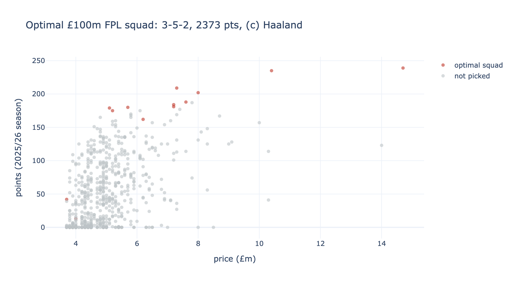

# ⚽ FPL squad optimiser

Picks the **mathematically optimal** Fantasy Premier League squad — the 15 players, the
starting XI, *and* the captain — by integer linear programming, under the £100m budget and
every real FPL rule. Live data from the official FPL API.

> **Live demo:** _add your Streamlit / Hugging Face Spaces URL here after deploying_



---

## The idea

Most FPL players pick by gut. This treats squad selection as what it actually is — a
**constrained optimisation problem** — and solves it exactly: which 15 players maximise
points, given a fixed budget and a strict squad structure? The chart above shows the result:
the optimiser hugs the value frontier, loading up on points-per-£m and parking cheap fodder
on the bench (the classic FPL move), all the way to a 2,373-point, £100.0m squad.

## The optimisation (the interesting bit)

It's a single integer linear program (PuLP / CBC) with three sets of binary decisions —
*in the 15?*, *in the starting XI?*, *captain?* — solved together:

- **Objective:** maximise the starting XI's points, counting the captain twice.
- **Squad:** exactly 2 GKP, 5 DEF, 5 MID, 3 FWD (15 players).
- **Formation:** a valid XI — 1 GKP, 3–5 DEF, 2–5 MID, 1–3 FWD.
- **Budget:** total price ≤ £100m.
- **Clubs:** at most 3 players from any one team.

The objective is swappable: `total_points` for a season review / pre-season plan, or
`ep_next` (FPL's own forward estimate) to optimise live during a season.

## What the app does

- Pulls **live** player data from the FPL API (prices, points, ownership, underlying stats).
- Re-optimises instantly as you change the **budget**, **max players per club**, **availability**,
  or **differential mode** (force in less-owned picks by capping ownership %).
- Shows the optimal XI + bench, the formation, the captain, and a points-vs-price view.

## Honest note on the data

This was built in the **off-season**, so FPL's live projections (`ep_next`) are zero. The app
therefore optimises on **last season's points** as the expected-points signal — effectively a
*pre-season squad planner* at current prices. The moment the season starts and `ep_next`
populates, switching the objective makes it a live gameweek optimiser. Nothing else changes.

## Run it

```bash
python -m venv .venv && source .venv/bin/activate
pip install -r requirements.txt

python src/fetch_data.py     # pull live FPL data -> data/players.parquet
python src/optimise.py       # print the optimal squad to the terminal
streamlit run app.py         # the interactive optimiser
```

Deploy free to **Streamlit Community Cloud** or a Hugging Face **Streamlit Space** (it fetches
its own data, so there's nothing to upload) and paste the URL above.

## Repo layout

```
fpl-optimiser/
├── app.py                # Streamlit app  ← the interactive optimiser
├── src/
│   ├── fetch_data.py     # FPL API -> tidy player table
│   └── optimise.py       # the integer linear program (PuLP)
├── figures/              # README visual
└── requirements.txt
```

## Tech

Python · PuLP (integer linear programming) · pandas · Streamlit · Plotly · the official FPL API

---

*Built by Abas Ukanga. Data: Fantasy Premier League public API.*
